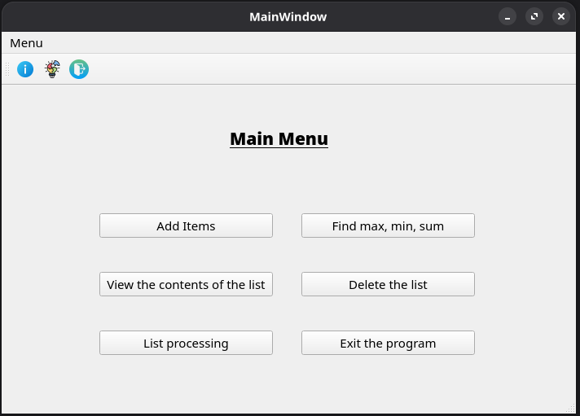
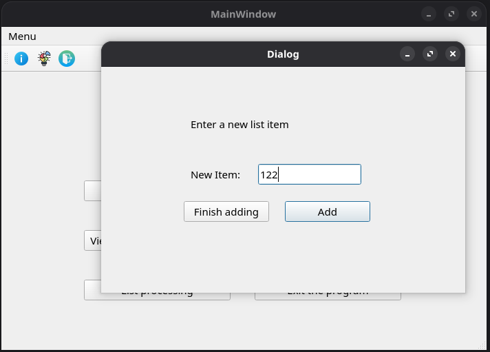

# qt-linked-list

A GUI application demonstrating a singly linked list
data structure, built with Qt 5 and C++.

## Screenshots

**Main window:**



**Adding elements:**



## Features
- Add integer elements to the list
- Find minimum, maximum and their sum
- View list contents in a separate dialog
- Remove all minimum elements from the list
- Delete the entire list
- Prevents duplicate processing (list can only
  be processed once)

## Implementation
The linked list is implemented from scratch using
a custom `node` struct with raw pointer traversal —
no STL containers used.

```cpp
struct node {
    int data;
    node* pNext;
};
```

Supported operations: `push_back`, `pop_front`,
`pop_back`, `removeAt`, `getMin`, `getMax`,
`remAllMin`, `allIsIdent`.

## Concepts demonstrated
- Qt Widgets: QMainWindow, QDialog, QMessageBox
- Signals and slots
- Modal and non-modal dialogs
- Input validation with QIntValidator
- OOP: LinkedList class separated from UI logic
- Shared state across multiple windows

## How to build
Requires Qt 5:
```bash
sudo apt install qt5-qmake qtbase5-dev
qmake Linked_List.pro && make
./Linked_List
```

## Notes
University coursework project (2022).
